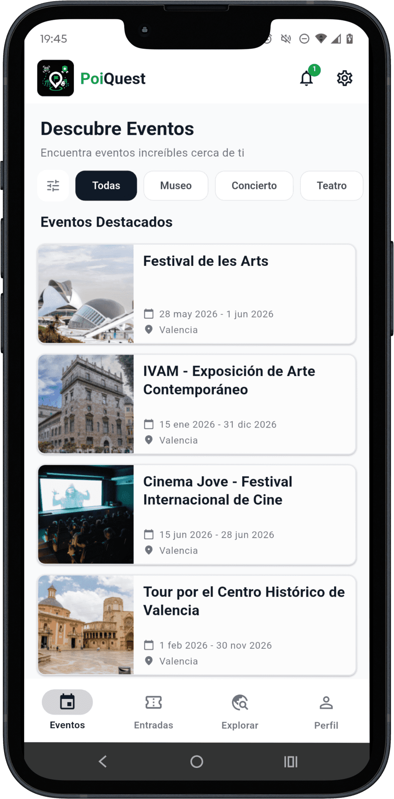
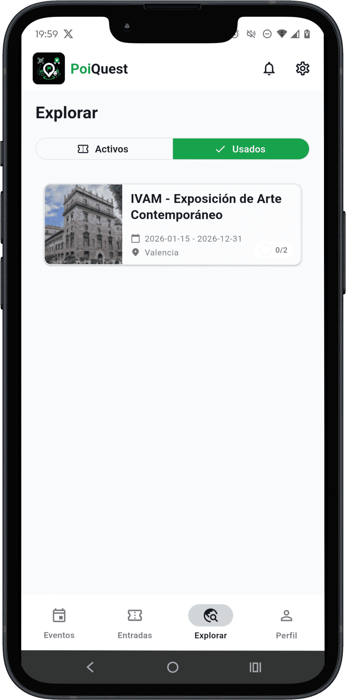
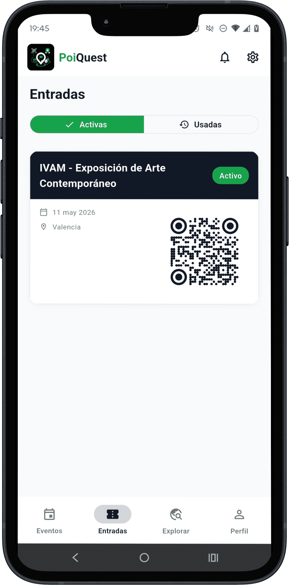
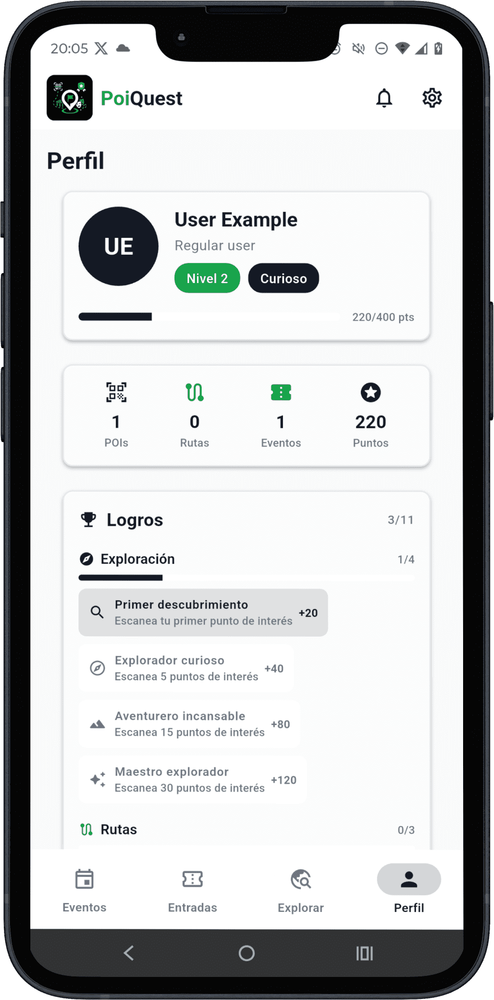

<p align="center">
  
</p>

<h1 align="center">PoiQuest — App de Usuario/Validador</h1>

<p align="center">
  <em>Explora, escanea y descubre experiencias culturales únicas</em>
</p>

<p align="center">
  <a href="https://flutter.dev"></a>
  <a href="https://dart.dev"></a>
  <a href="https://riverpod.dev"></a>
  <a href="https://m3.material.io"></a>
  <a href="https://developer.android.com"></a>
  <a href="LICENSE"></a>
</p>

---

> Aplicación móvil multiplataforma del ecosistema **PoiQuest** dirigida tanto al **usuario final** (descubrir eventos, comprar entradas, explorar POIs, gestión del perfil personal y gamificación) como a los **validadores** (validación de tickets QR en el acceso físico con historial de entradas registradas).

---

## Índice

1. [¿Qué hace esta app?](#qué-hace-esta-app)
2. [Capturas de pantalla](#capturas-de-pantalla)
3. [Características principales](#características-principales)
4. [Stack tecnológico](#stack-tecnológico)
5. [Arquitectura](#arquitectura)
6. [Estructura del proyecto](#estructura-del-proyecto)
7. [Puesta en marcha](#puesta-en-marcha)
8. [Variables de entorno](#variables-de-entorno)
9. [Features](#features)
10. [Contribución](#contribución)
11. [Autor](#autor)
12. [Licencia](#licencia)

---

## ¿Qué hace esta app?

PoiQuest transforma la asistencia a eventos culturales en una experiencia interactiva y gamificada:

1. **Descubre eventos culturales** — Navega por el catálogo filtrado por categoría, precio y fecha. Consulta el detalle de cada evento junto con sus rutas y puntos de interés asociados.
2. **Adquiere tu entrada** — Reserva acceso gratuito o compra entradas de pago mediante el formulario de Stripe integrado directamente en la pantalla del evento.
3. **Valida tu ticket en el acceso** — El organizador escanea el QR de tu entrada para darte acceso físico. Tu ticket queda activado para iniciar la exploración.
4. **Explora las rutas y escanea POIs** — Sigue rutas culturales en un mapa interactivo con geolocalización en tiempo real y escanea los QR de los puntos de interés para desbloquear contenido enriquecido.
5. **Visualiza en realidad aumentada** — Apunta la cámara al entorno físico y accede al modelo 3D del punto de interés o a su información histórica mediante ARCore.
6. **Gestiona tu perfil** — Edita tus datos personales, cambia tu avatar, consulta tus estadísticas de actividad y revisa los logros desbloqueados desde una pantalla de perfil dedicada.
7. **Acumula puntos y sube de nivel** — Cada escaneo, ruta completada y evento premium suma puntos que permiten progresar por los 5 niveles (Explorador → Maestro Cultural) y desbloquear logros y recompensas.

---

## Capturas de pantalla

<p align="center">
  
  &nbsp;&nbsp;
  
  &nbsp;&nbsp;
  
  &nbsp;&nbsp;
  
</p>

> Las capturas muestran el modo claro de la interfaz. La app soporta también modo oscuro completo.

---

## Características principales

- **Renovación automática de JWT** — Interceptor Dio detecta el 401, renueva el access token con el refresh almacenado en `flutter_secure_storage` y reintenta la petición original sin intervención del usuario.
- **Realidad aumentada nativa** — `arcore_flutter_plus` descarga el modelo 3D GLB del POI directamente desde MinIO y lo renderiza sobre la cámara del dispositivo sin intermediarios web ni WebView.
- **Validación QR multicapa** — El escaneo con `mobile_scanner` valida en backend que el ticket está en estado `USED`, la fecha de visita coincide con el día actual y el POI pertenece al evento del ticket.
- **Pagos nativos con Stripe** — `flutter_stripe` integra el PaymentSheet nativo sin WebView ni redirecciones externas; el backend controla el aforo en tiempo real antes de confirmar el pago.
- **Paginación por cursor** — Eventos, notificaciones y entradas usan paginación por cursor en lugar de offset, evitando duplicados al insertar nuevos registros entre páginas.
- **Geolocalización en tiempo real** — `geolocator` actualiza la posición del usuario continuamente en el mapa de ruta (`flutter_map`) con marcadores de POIs ordenados y estado de progreso por punto.
- **Internacionalización generada** — Textos ES/EN definidos en archivos ARB y clases de localización generadas automáticamente con `flutter gen-l10n` + `flutter_localizations`; idioma seleccionable desde preferencias.
- **Modo claro/oscuro con paleta propia** — Tema Material Design 3 con paleta personalizada (verde, azul oscuro, dorado, rojo) que soporta ambos modos, seleccionable desde preferencias y persistido con `shared_preferences`.
- **Clean Architecture por features con Riverpod** — Cada módulo es completamente independiente y se estructura en tres capas (domain, data, presentation); Riverpod actúa como contenedor de inyección de dependencias entre capas sin acoplar la UI al origen de datos.

---

## Stack tecnológico

| Tecnología | Versión | Uso en el proyecto |
|---|---|---|
| [Flutter](https://flutter.dev) | 3.x | Framework UI multiplataforma |
| [Dart](https://dart.dev) | 3.x | Lenguaje principal |
| [Riverpod](https://riverpod.dev) | 3.x | Gestión de estado reactivo y DI |
| [go_router](https://pub.dev/packages/go_router) | 16.x | Navegación declarativa con guardas de autenticación |
| [Dio](https://pub.dev/packages/dio) | 5.x | Cliente HTTP con interceptores de refresco JWT |
| [flutter_stripe](https://pub.dev/packages/flutter_stripe) | 12.x | Integración nativa de pagos con Stripe |
| [mobile_scanner](https://pub.dev/packages/mobile_scanner) | 7.x | Escaneo de códigos QR en tiempo real |
| [arcore_flutter_plus](https://pub.dev/packages/arcore_flutter_plus) | 1.x | Realidad aumentada (ARCore) |
| [flutter_map](https://pub.dev/packages/flutter_map) | 7.x | Mapas interactivos sobre OpenStreetMap |
| [geolocator](https://pub.dev/packages/geolocator) | 13.x | Geolocalización del usuario en tiempo real |
| [flutter_secure_storage](https://pub.dev/packages/flutter_secure_storage) | 9.x | Almacenamiento seguro de tokens JWT |
| [Material Design 3](https://m3.material.io) | — | Sistema de diseño con paleta y tema personalizados |

---

## Arquitectura

La app sigue **Clean Architecture por features**: cada módulo funcional es completamente independiente del resto y se estructura en tres capas verticales.

| Capa | Responsabilidad | Archivos típicos |
|------|----------------|-----------------|
| **domain** | Lógica de negocio pura, sin dependencias externas | `entities/`, `repositories/` (abstractos), `usecases/` |
| **data** | Acceso a datos remotos y persistencia local | `datasources/`, `models/` (JSON ↔ entidad), `repositories/` (implementaciones) |
| **presentation** | Interfaz de usuario y estado reactivo | `pages/`, `widgets/`, `providers/` (Riverpod Notifiers) |

Además de los features, la app tiene dos directorios transversales:

| Directorio | Contenido |
|-----------|-----------|
| `app/` | Router global (`go_router`) y definición del `ThemeData` claro/oscuro con Material Design 3 |
| `core/` | Widgets reutilizables, `AppService` (Dio + interceptores), utilidades, `l10n` y helpers de fecha y URL |

---

## Estructura del proyecto

```
lib/
├── app/
│   ├── router.dart              # Rutas declarativas y guardas de auth
│   └── theme/
│       ├── app_theme.dart       # ThemeData claro y oscuro
│       └── app_palette.dart     # Paleta de colores personalizada
├── core/
│   ├── l10n/                    # Archivos ARB + AppLocalizations generado
│   ├── utils/                   # Env, Constants, AppService, DateUtils…
│   └── widgets/                 # AppButton, AppCard, AppTextField, AppBadge…
└── features/
    ├── auth/
    ├── events/
    ├── explore/
    ├── tickets/
    ├── profile/
    ├── gamification/
    ├── notifications/
    ├── preferences/
    └── ticket_validator/
```

Cada feature sigue la misma estructura interna:

```
feature/
├── data/
│   ├── datasources/             # Llamadas HTTP con Dio
│   ├── models/                  # Modelos JSON con fromJson / toJson
│   └── repositories/            # Implementaciones de los repositorios
├── domain/
│   ├── entities/                # Clases Dart puras (sin anotaciones)
│   ├── repositories/            # Contratos abstractos (interfaces)
│   └── usecases/                # Un caso de uso por operación de negocio
└── presentation/
    ├── pages/                   # Pantallas completas (ConsumerWidget)
    ├── providers/               # Notifiers y Providers de Riverpod
    └── widgets/                 # Widgets específicos del feature
```

---

## Puesta en marcha

### Requisitos previos

- [Flutter SDK](https://docs.flutter.dev/get-started/install) ≥ 3.x
- Dispositivo Android físico con **ARCore** para probar la realidad aumentada
- Backend PoiQuest en ejecución (ver [poiquest_backend_nestjs](https://github.com/alexMartJu/PoiQuest_backend_nestjs))

### Pasos

```bash
# 1. Clonar el repositorio
git clone https://github.com/alexMartJu/PoiQuest_frontend_flutter.git
cd PoiQuest_frontend_flutter

# 2. Instalar dependencias
flutter pub get

# 3. Configurar variables de entorno
cp .env.example .env
# Edita .env y añade tu STRIPE_PUBLISHABLE_KEY

# 4a. Ejecutar en emulador Android
flutter run --dart-define=API_BASE_URL=http://10.0.2.2:8000

# 4b. Ejecutar en dispositivo físico
# Sustituye la IP por la de tu máquina en la red local y el DEVICE_ID
# por el número de serie de tu dispositivo (obtenido con: flutter devices)
flutter run -d <DEVICE_ID> --dart-define=API_BASE_URL=http://<IP_LOCAL>:8000

# 5. (Producción) Generar APK firmado
flutter build apk --dart-define=API_BASE_URL=https://api.tudominio.com
```

> **Nota AR:** La realidad aumentada requiere un dispositivo Android físico con soporte para ARCore. En emuladores, el flujo QR funciona con normalidad pero la vista AR no renderizará el modelo 3D.

---

## Variables de entorno

| Variable | Origen | Descripción | Ejemplo |
|---|---|---|---|
| `API_BASE_URL` | `--dart-define` (compilación) | URL base de la API REST del backend | `http://10.0.2.2:8000` |
| `STRIPE_PUBLISHABLE_KEY` | `.env` (flutter_dotenv) | Clave pública de Stripe para el SDK de pagos | `pk_test_51…` |

Copia `.env.example` como `.env` y rellena los valores antes de ejecutar la app.

---

## Features

| Feature | Páginas principales | Descripción |
|---------|-------------------|-------------|
| `auth` | `AuthPage` | Login y registro con JWT. Refresco automático del token con interceptor Dio. Tokens persistidos en `flutter_secure_storage` |
| `events` | `EventsPage`, `EventDetailPage`, `PoiDetailPage`, `RouteDetailPage` | Catálogo paginado por cursor, filtros por categoría/precio/fecha, detalle de evento con rutas y POIs |
| `explore` | `ExplorePage`, `ExploreEventDetailPage`, `ExplorePoiScanPage`, `ExplorePoiArPage`, `ExploreRouteNavigationPage` | Núcleo de la experiencia: progreso de visita → escaneo QR → realidad aumentada → mapa de ruta con GPS |
| `tickets` | `TicketsPage` | Mis entradas activas y usadas, código QR presentable y compra integrada con Stripe |
| `profile` | `ProfilePage`, `ProfileEditPage`, `ProfileChangeAvatarPage`, `ProfileChangePasswordPage` | Información personal, nivel de gamificación, logros desbloqueados y gestión de cuenta |
| `gamification` | *(embebido en Perfil)* | 5 niveles (Explorador → Maestro Cultural), 11 logros con progreso y estadísticas de actividad |
| `notifications` | `NotificationsPage` | Historial paginado con cursor, contador de no leídas en AppBar y marcado individual / masivo |
| `preferences` | `PreferencesPage` | Modo claro/oscuro, idioma (ES/EN) y activación de notificaciones persistidos con `shared_preferences` |
| `ticket_validator` | `TicketValidatorPage`, `ValidationHistoryPage` | Validador QR para organizadores con confirmación de resultado y historial filtrable por fecha |

---

## Contribución

1. Haz un fork del repositorio y crea tu rama: `git checkout -b feature/mi-mejora`
2. Verifica el análisis estático sin errores: `flutter analyze`
3. Ejecuta los tests: `flutter test`
4. Formatea el código: `dart format .`
5. Haz commit con mensaje descriptivo: `git commit -m "feat: descripción de la mejora"`
6. Abre una Pull Request detallando los cambios y el contexto

---

## Autor

**Alex Martinez Juan**  
GitHub: [@alexMartJu](https://github.com/alexMartJu)

---

## Licencia

Este proyecto está publicado bajo la [Licencia MIT](LICENSE).
